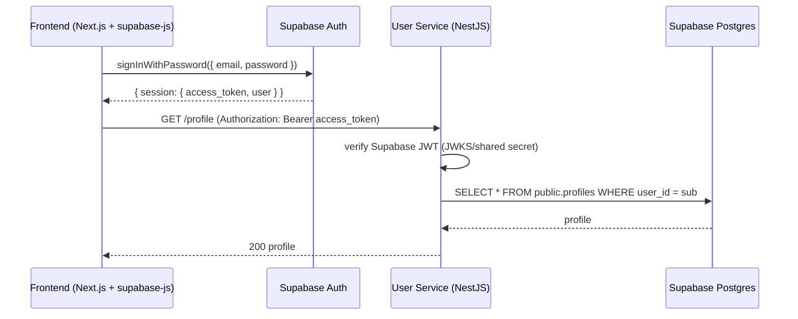
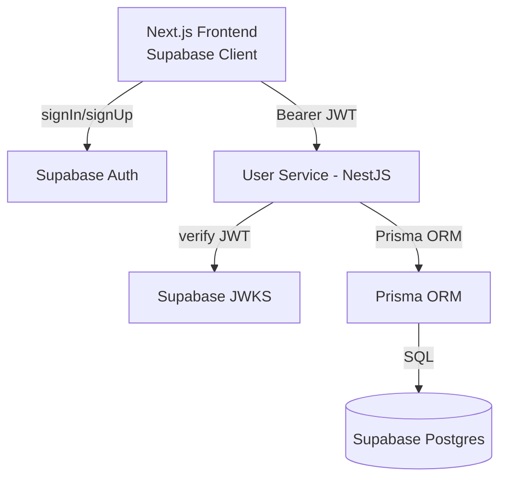
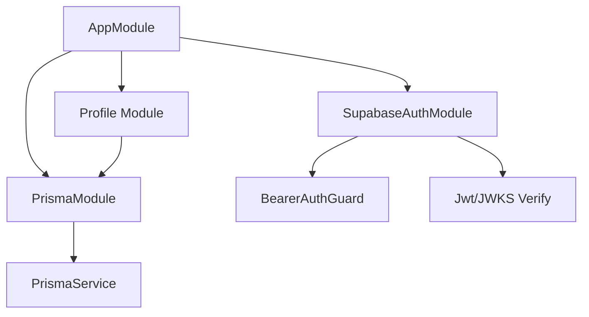
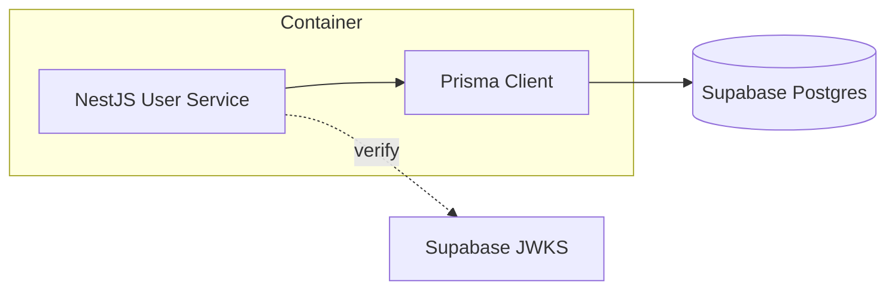

# User Service — CS3219 AY25/26 S1 Project G36

This service provides **user management and authentication** (signup, login, profile, and question handling) for the **PeerPrep** platform.  
It’s built with **NestJS**, **Prisma ORM**, and a **PostgreSQL** backend, and is containerized using **Docker** for consistent deployment.

---

## Tech Stack

| Layer             | Technology                            |
| ----------------- | ------------------------------------- |
| Backend Framework | [NestJS](https://nestjs.com/)         |
| ORM               | [Prisma](https://www.prisma.io/)      |
| Database          | [Supabase](https://supabase.com/docs) |
| Authentication    | JWT (Bearer Auth)                     |
| Containerization  | Docker + Docker Compose               |
| Language          | TypeScript (Node.js 20)               |

---

## Responsibility & Scope

- **Auth**: `POST /auth/signup`, `POST /auth/login` (issue JWT), token verification.
- **Profile**: `GET /profile`, `PUT /profile` (authenticated).
- **(Optional in repo)** Questions CRUD if colocated, else separate service.
- **Persistence**: PostgreSQL via **Prisma** (primary). Optional Mongo provider for flexible docs.
- **Security**: Bearer JWT guard (`bearer-auth.guard.ts`), DTO validation, password hashing.

---

## Auth Flow (Supabase)

### Login + Profile Access



- **No custom `/auth/login` endpoint** is required on the service. The service trusts Supabase as the Identity Provider (IdP).
- For SSR (Next.js server components), pass the access token via cookies/headers to the service.

---

## High-Level Component Diagram (Supabase)



---

## Internal Modules (NestJS)



---

## Auth Flow (Login → Profile) — unchanged


---

## Deployment (Service-only with Supabase)



- Container exposes `4001`.
- On Alpine, use `binaryTargets = ["native", "linux-musl"]` in `schema.prisma`.
- Avoid docker-compose bind mounts that overwrite `/app/node_modules`.
- Migrations: `npx prisma migrate deploy` during release or CI step.

---

## Project Structure

```
user-service/
├── src/
│   ├── auth/                 # JWT guards, BearerAuthGuard, JwtService
│   ├── dto/                  # Handles typing for response
│   ├── mongodb/              # Mongo provider (if applicable)
│   ├── prisma/               # Prisma service integration
│   ├── profile/              # Profile controller + service
│   ├── questions/            # Question CRUD and business logic
│   └── main.ts               # App bootstrap
│
├── prisma/
│   ├── schema.prisma         # Prisma schema definition
│
├── Dockerfile                # Multi-stage build
├── docker-compose.yml        # Local orchestration
├── package.json
├── tsconfig.json
└── README.md                 # ← You’re here
```

---

## Running with Docker

### Build the Docker image

```bash
docker build --no-cache -t user-service:latest .
```

### Run the container

```bash
docker run -p 4001:4001 --env-file .env user-service:latest
```

### Or use Docker Compose

```bash
docker compose build user-service
docker compose up user-service
```

---

## Prisma Setup

### Generate Prisma Client

```bash
npx prisma generate
```

### Migrate the Database

```bash
npx prisma migrate deploy
```

### Inspect the DB (optional)

```bash
npx prisma studio
```

---

## Authentication Flow

- **Signup:** Creates a new user and hashes password using bcrypt.
- **Login:** Validates credentials, returns JWT token.
- **Protected Routes:** Use `BearerAuthGuard` and `JwtService` for authorization.
- **Profile:** Users can view and update their profile information.

---

## API Endpoints

| Method | Route          | Description                 | Auth |
| ------ | -------------- | --------------------------- | ---- |
| `POST` | `/auth/signup` | Register a new user         | NA   |
| `POST` | `/auth/login`  | Login with email + password | NA   |
| `GET`  | `/profile`     | Get current user profile    | JWT  |
| `PUT`  | `/profile`     | Update user profile         | JWT  |
| `GET`  | `/questions`   | List all questions          | JWT  |
| `POST` | `/questions`   | Create a question           | JWT  |

---

## AI Usage Declaration

### Allowed AI Assistance

- Used ChatGPT (GPT-5) and GitHub Copilot for boilerplate generation, debugging, and form validation logic.
- All AI-assisted code was **reviewed and modified manually**.
- No AI used for architecture design, schema planning, or requirement decisions.

### File-level Attributions

Each file includes a top-level comment like:

```ts
/*
AI Assistance Disclosure:
Tool: ChatGPT (GPT-5)
Scope: Suggested service logic for user profile and authentication.
Author review: Modified and verified correctness manually.
*/
```

## Development (Local)

```bash
npm install
npx prisma generate
npm run start:dev
```

---

## Authors

| Name           | Contribution                                  |
| -------------- | --------------------------------------------- |
| Jonathen Cheng | User Service, Auth System, Profile Management |
